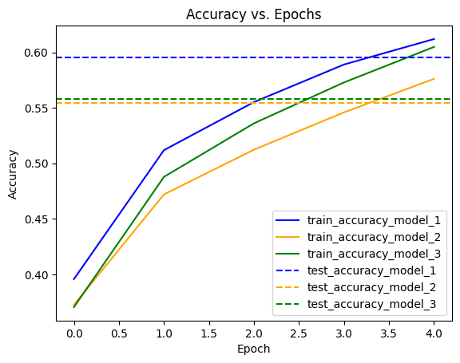

# CNN Architecture & Training Experiments (TensorFlow/Keras)

A set of controlled experiments on CIFAR-10 exploring how CNN design choices — architecture complexity, data augmentation, and transfer learning — affect accuracy and generalization.

## Part 1 — Architecture & Hyperparameter Study

Several CNN variants were designed and benchmarked against each other, varying:
- **Depth/complexity** — a simple two-conv-layer baseline vs. deeper variants with BatchNorm and Dropout
- **Filter counts** — narrower vs. wider convolutional layers
- **Kernel sizes** — how receptive field size trades off against parameter count

Each variant's train/test accuracy and loss were tracked across epochs to separate genuine capacity gains from overfitting:



## Part 2 — Data Augmentation for Generalization

The same baseline architecture was trained with and without on-the-fly data augmentation (random horizontal flips, rotation, zoom) to isolate augmentation's effect on the train/test gap:

| Model | Train Accuracy | Test Accuracy | Gap |
|---|---|---|---|
| No augmentation | 0.7910 | 0.7147 | 0.076 |
| **With augmentation** | 0.6391 | 0.6211 | **0.018** |

The augmented model scores lower in absolute terms after the same 5 epochs — it's solving a harder, noisier training problem — but generalizes noticeably better. The much smaller train/test gap is the point of the experiment, not the raw accuracy number.

## Part 3 — Transfer Learning (MobileNetV2)

A pretrained MobileNetV2 (ImageNet weights) was fine-tuned for a binary image classification task, to compare training a small CNN from scratch against adapting a large pretrained network. On the small (~250-image) dataset used here, fine-tuning reached ~98% test accuracy — the dataset is too small to treat that figure as a general benchmark, but it demonstrates the transfer-learning workflow end to end: freezing the base network, replacing the classification head, and fine-tuning.

## Tech Stack

Python · TensorFlow/Keras (`Conv2D`, `BatchNormalization`, `Dropout`, Keras augmentation layers, `MobileNetV2`) · NumPy · Matplotlib

## Running This Project

```bash
pip install tensorflow numpy matplotlib jupyter
jupyter notebook Design_and_train_CNN.ipynb    # Part 1
jupyter notebook Data_augmentation.ipynb       # Part 2
jupyter notebook Transfer_learning.ipynb       # Part 3
```
